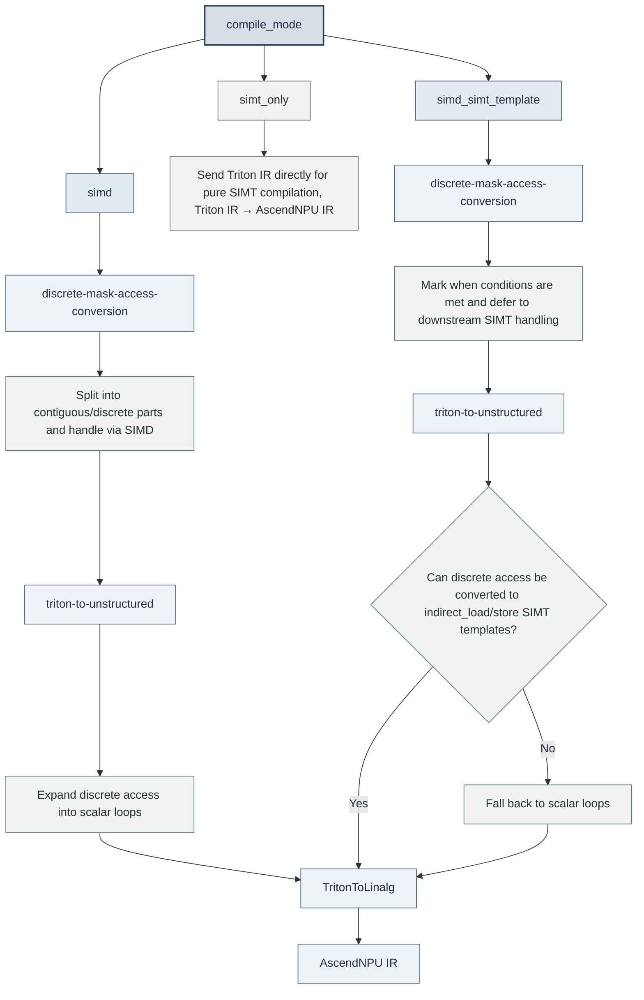

# Architecture Design and Core Features

## 1. Logical Architecture


**Triton-Ascend Architecture Description**

**Core components:**

- **`Ascend language extension`**: Triton language extension for Ascend
- **`compiler`**: Triton compiler for Ascend
- **`driver`**: Ascend device driver API

**Component functions:**

- **`Ascend language extension`**
  Syntax and semantic extensions for the Ascend NPU architecture are introduced based on the standard Triton language.

- **`compiler`**
  Receives the Triton IR `(TTIR)` file generated by the upper-layer Triton compiler and performs a series of transformations to adapt to Ascend hardware.

  ```text
  Triton IR → Linalg IR → AscendNPU IR → kernel*.o
  ```

  The compilation flow is divided into two stages:

  - **Triton-Ascend stage (Triton IR → Linalg IR)**: Triton-Ascend's MLIR passes (such as `TritonToLinalg`) lower Triton IR to Linalg IR, converting operator semantics into structured linear algebra representations.
  - **BiSheng Compiler stage (Linalg IR → AscendNPU IR → `kernel*.o`)**: The BiSheng Compiler takes over the subsequent compilation, lowering Linalg IR to AscendNPU IR tailored for the Ascend NPU, performing hardware-specific instruction selection, memory allocation, and scheduling optimization, and finally generating the device-side executable binary `kernel*.o`.

- **`driver`**
  Provides the interconnection capability between the Triton runtime and the Ascend software stack (CANN), and loads the device-side executable kernel `kernel*.o` generated by the BiSheng Compiler.

## 2. Code Structure

### 2.1 Code Structure Principles

This project extends the support for Huawei Ascend NPU (using the CANN software stack) based on the standard Triton. The overall design complies with the following **code principles**:

**(1) Ownership decision: where the change lands depends on hardware affinity**

> - **If the modification is target independent**, it should be retained in the **Triton core** part (such as general modifications to the language and runtime).
> - **If the modification is strongly Ascend-target affinitive**, it should be placed in the **Triton-Ascend** part.

**(2) Landing approach: keep upstream code untouched, carry changes as patches**

To stay synchronized with upstream Triton / LLVM and reduce merge conflicts during version upgrades, the community source tree is **not modified in place** by default:

> - Ascend-specific logic is first implemented as independent modules inside `third_party/ascend/`, rather than editing community directories such as `python/`, `include/`, and `lib/` in place.
> - When a change to community code (Triton core or LLVM/MLIR) is unavoidable, the source files are not edited directly. Instead, the change is captured as a standalone `.patch` kept under `third_party/ascend/patch/` and applied with `git apply` during the build preparation stage.
> - Each patch must correspond to a specific community baseline version / commit (reflected by a version number or commit in the file name). Target-independent improvements should preferably be contributed upstream to reduce the local patch footprint at the source.

### 2.2 Directory Structure and Function Description

| Directory or File | Architecture Layer | Description |
| --- | --- | --- |
| `python/` | Triton core | Contains the common Python implementation from standard Triton, including `triton.language`, JIT, runtime, cache, and tool entry points. Target-independent capabilities should live here first. |
| `include/` and `lib/` | Triton core | Contains the common C++/MLIR infrastructure, dialects, passes, and conversion logic from standard Triton. Ascend-specific backend code is not placed here. |
| `third_party/ascend/` | Triton-Ascend | Root directory of the Ascend backend. It contains Ascend NPU, CANN, and BiSheng Compiler-specific language extensions, compiler backend, runtime driver, MLIR passes, examples, and tests. |
| `third_party/ascend/patch/` | Triton-Ascend | Holds non-invasive patches (`.patch`) against community Triton core and LLVM/MLIR, applied with `git apply` during the build preparation stage so the community source tree stays clean and easy to upgrade with upstream. |
| `third_party/ascend/language/` | Ascend language extension | Contains Ascend language extensions. During installation, this directory is linked under `triton.language.extra`, so Triton kernels can use `triton.language.extra.cann`. |
| `third_party/ascend/language/cann/libdevice.py` | Ascend language extension | Provides the Ascend NPU-adapted Python `libdevice` interface, including math functions and low-level operator wrappers used by Triton kernels. |
| `third_party/ascend/backend/compiler.py` | compiler | Main entry of the Ascend compiler backend. It registers compiler options, organizes TTIR lowering to Ascend-adapted IR, Linalg, LLVM, and related stages, and invokes the downstream toolchain to generate executable binaries. |
| `third_party/ascend/backend/driver.py` | driver | Ascend runtime driver module. It connects Triton runtime with CANN/TorchNPU runtime environments and launches compiled device-side executables. |
| `third_party/ascend/include/` and `third_party/ascend/lib/` | compiler | Contains Ascend-specific MLIR dialects, passes, and conversions, such as `TritonToLinalg`, `TritonToStructured`, `DynamicCVPipeline`, and `AutoBlockify`. |
| `third_party/ascend/AscendNPU-IR/` | compiler | Contains Ascend NPU IR and BiSheng compilation-chain integration used by the Triton-Ascend pipeline when lowering further toward hardware code generation. |
| `third_party/ascend/tutorials/` and `third_party/ascend/unittest/` | Examples and tests | Provides Triton examples on Ascend, migration examples, Python unit tests, and MLIR conversion tests for validating Ascend backend capabilities. |

## 3. Modules

### 3.1 Triton Core Enhancement

#### 3.1.1 Language Extension

To support more flexible tensor sub-region operations and single-element access, the language layer provides the following extension operators:

| Operator | Brief description |
| :--- | :--- |
| `extension.insert_slice(full, src, offsets, sizes, strides)` | Inserts the source tensor into the target tensor according to the specified offsets, sizes, and strides. Returns the target tensor. |
| `extension.extract_slice(full, offsets, sizes, strides)` | Extracts a slice tensor from the tensor according to the specified offsets, sizes, and strides. Returns the slice tensor. |
| `extension.get_element(source, offset)` | Reads a single element from the tensor at the specified offset. |

The full function signatures, parameter meanings, and examples are maintained in the Python API reference (to avoid duplicating them in the architecture document): see the *Vector/Memory Extension Ops* section of [triton.language.extra.cann.extension](https://triton-ascend.readthedocs.io/en/latest/python-api/triton.language.extra.cann.extension.html).

### 3.2 Triton-Ascend

#### 3.2.1 Compiler Options

NPUOptions are parameters that control the **compilation strategy of a single kernel**. They can be passed through `triton.Config`, Autotune arguments, or kernel launch meta-parameters, and take effect at compile time across the TTIR → Linalg IR → AscendNPU IR stages. They can be grouped by purpose as follows:

| Category | Purpose | Typical options |
| --- | --- | --- |
| Compilation mode and general pipeline | Select the SIMD/SIMT compilation path and control the ping-pong pipeline | `compile_mode`, `multibuffer` |
| Graph optimization | Toggle Graph Optimization at the TTIR level | `enable_graph_optimize` |
| CV fusion and tiling | Automatic sub-block binding, Cube/Vector balancing and splitting | `enable_auto_bind_sub_block`, `enable_hivm_auto_cv_balance`, `enable_cube_block_merge`, `tile_mix_vector_loop`, `tile_mix_cube_loop` |
| VF / HFusion | VF fusion strategy and multiple-consumer fusion on the 950 series | `enable_vf_fusion`, `vf_fusion_mode`, `hfusion_enable_multiple_consumer_fusion` |
| Synchronization | Solver, unit flag, and barrier/block injection | `sync_solver`, `unit_flag`, `inject_barrier_all`, `inject_block_all` |
| Multi-buffering and workspace | Multi-buffering scope and level for local buffer / workspace | `limit_auto_multi_buffer_only_for_local_buffer`, `limit_auto_multi_buffer_of_local_buffer`, `set_workspace_multibuffer` |
| DynamicCV buffering | Number of buffer slots for veccore / cross-core / GM | `buf_slot_num_of_veccore`, `buf_slot_num_of_crosscore`, `buf_slot_num_of_gm` |
| Toolchain pass-through | Forward additional arguments to the BiSheng compilation path | `bisheng_options` |

The full option list, default / allowed values, and configuration methods are maintained in the reference document (to avoid inconsistencies caused by maintaining two copies): see [Environment Variables and Compiler Options · Compiler Option Reference Table](https://triton-ascend.readthedocs.io/en/latest/environment_variable_and_compiler_options_reference.html#compiler-options-reference). For the compatibility behavior of deprecated options and rename mappings, see [Compiler Option Cleanup and Compatibility](https://triton-ascend.readthedocs.io/en/latest/environment_variable_and_compiler_options_reference.html#compiler-option-cleanup-and-compatibility) in the same document.

#### 3.2.2 SIMD Compiler

| No.| Pass                   | Purpose                                                                  | IR Conversion                |
| ------ | ---------------------- |----------------------------------------------------------------------| ----------------------- |
| 1      | triton-to-structured   | linearize                                                             | ttir->ttir              |
| 2      | triton-to-unstructured | convert indirect axis to loop                                        | ttir->ttir              |
| 3      | triton-to-linalg       | memory/reduction/view/creation/math/arith/linear algebra to linalgir | ttir->linalgir          |
| 4      | triton-to-other        | ttir->hivm/hfusion/llvm                                              | ttir->hivm/hfusion/llvm |

##### 3.2.2.1 TritonToStructured

The integer division and modulo operations in pointer expressions and mask expressions are converted to tensor operations to regenerate OPs such as load and store.

| Converter                | Description | Limitation|
| ------------------------ | -------------------------- | ------------------------- |
| RewriteAddPtrOp          | Analyzes the pointer expression (`AddPtrOp`) in operations such as `tl.load` and `tl.store`. The original pointer offset is calculated and modeled into a `PtrState` object that contains the specific offset information of each dimension (axis). For example, for an expression like `ptr + x // 1024 * 4096 + x % 1024 * 4 + y`, the contributions and relationships of the `x` and `y` axes are analyzed.                  | 1. The original iteration axis (such as `x`) must be exactly divisible by the split axis (such as `1024`).<br>2. The size of the external `XBLOCK` must be an integer multiple or divisor of the split axis `divisor`.                              |
| CreateAddPtr              | Reconstructs a new `AddPtrOp` pointer calculation operation based on the analyzed `PtrState` object to eliminate the integer division (`//`) and modulo (`%`) operations in the original expression.                                                                      | It depends on the valid `PtrState` object successfully generated by `RewriteAddPtrOp`.                                                                                                    |
| MemOpConverter::LoadConverter            | Analyzes the `mask` expression in the `tl.load` operation and decomposes and models the complex mask conditions involving integer division and modulo into a `MaskState` object that contains the boundary information of each dimension. For example, for `mask = x // 1024 < 8 and x % 1024 < 1024 and y < 4`, an independent constraint condition of each dimension is obtained through analysis.                                                                    | 1. The original iteration axis (such as `x`) must be exactly divisible by the split axis (such as `1024`).<br>2. The size of the external `XBLOCK` must be an integer multiple or divisor of the split axis `divisor`.                              |
| MaskState                | Reconstructs a new `mask` expression based on the analyzed `MaskState` object to eliminate the integer division (`//`) and modulo (`%`) operations in the original expression.                                                                                           | Only the `MaskState` object generated by `MemOpConverter::LoadConverter` or `MemOpConverter::StoreConverter` is processed. Any complex and non-standardized mask expressions cannot be processed.                                                  |
| LoadConverter::matchAndRewrite               | Re-creates/Replaces the original `tl.load` operation using the new pointer expression generated by `CreateAddPtr` and the new mask expression generated by `MaskState` to complete instruction rewriting.                                                                                                                                                              | The prerequisite steps, such as `RewriteAddPtrOp`, `CreateAddPtr`, `MemOpConverter::LoadConverter`, `MaskState`, must have been successfully executed.                                                               |
| MemOpConverter::StoreConverter           | Analyzes the `mask` expression in the `tl.store` operation. Its function is similar to that of `MemOpConverter::LoadConverter`. It decomposes and models the complex mask conditions involving integer division and modulo into a `MaskState` object.                                                                                                                                                      | Same as `MemOpConverter::LoadConverter`.                                                                                                                                   |
| StoreConverter::matchAndRewrite              | Re-creates/Replaces the original `tl.store` operation using the new pointer expression generated by `CreateAddPtr` and the new mask expression generated by `MaskState` to complete instruction rewriting.                                                                                                                                                             | The prerequisite steps, such as `RewriteAddPtrOp`, `CreateAddPtr`, `MemOpConverter::StoreConverter`, `MaskState`, must have been successfully executed.                                                              |

##### 3.2.2.2 TritonToUnstructured

| No.| Pass/Converter                             | Description |
|------|-------------------------------------------|-----------------------------------------------------------------------------------------------------------------------------------------------------------------------|
| 1    | discrete-mask-access-conversion           | Analyzes and converts the memory access pattern based on the discrete index mask in Triton (for example, `triton.language.load` with a non-contiguous mask) to prepare for the subsequent expansion of discrete axes into loops. This pass identifies irregular or sparse access patterns that cannot be efficiently processed by the backend hardware.|
| 2    | triton-to-unstructured           | Converts the tensor operations identified by `discrete-mask-access-conversion` and containing discrete axes into scalar memory access based on explicit scalar loops.|
| 3    | bubble-up-operation                       | Bubbles up `extract op/extract_slice` for optimization. This can optimize data locality. In some scenarios, unnecessary loops generated after the transformation can be eliminated, thereby improving the execution efficiency of the generated code.|

###### 3.2.2.2.1 discrete-mask-access-conversion

| Converter                 | Description|
|----------------------------|--------------------------------------------------------------------------------------------------------------------------------------------------------------------------------------------------------|
| DiscreteMaskStoreConversion | Analyzes the mask and converts the original store operation into the following sequences if it is non-contiguous:<br>1. load (loading the content at the target address)<br>2. select (selecting the target content and the value to be stored based on the mask)<br>3. store (storing the select result back to the target address)|
| DiscreteMaskLoadConversion  | Analyzes the mask and converts the original load operation into the following sequences if it is non-contiguous:<br>1. load (loading all content of the source tensor)<br>2. select (selecting the source tensor content based on the mask, and setting the masked part to the other value)                    |
| DiscreteMaskAtomicAddConversion | Analyzes the mask and converts the original atomic_add operation into the following sequences if it is non-contiguous:<br>1. select (selecting the value based on the mask and setting the masked part to **0**)<br>2. atomic_add (regenerating the atomic_add operation using the select result)|

###### 3.2.2.2.2 triton-to-unstructured

| TritonToUnstructured Converter| Description|
|---|---|
| UnstructuredMemAccessConverter\<triton::LoadOp\> | Converts LoadOp into a multi-loop scalar load operation.|
| UnstructuredMemAccessConverter\<triton::StoreOp\> | Converts StoreOp into a multi-loop scalar store operation.|
| UnstructuredMemAccessConverter\<triton::AtomicRMWOp\> | Converts AtomicRMWOp into a multi-loop scalar atomic operation.|
| UnstructuredMemAccessConverter\<triton::AtomicCASOp\> | Converts AtomicCASOp into a multi-loop scalar atomic operation.|

###### 3.2.2.2.3 bubble-up-operation

| Converter| Description|
|---|---|
| BubbleUpExtract\<tensor::ExtractOp\> | Bubbles up extract op, avoiding unnecessary loops in some scenarios.|
| BubbleUpExtract\<tensor::ExtractSliceOp\> | Bubbles up extract op/extract_slice, avoiding unnecessary loops in some scenarios.|

##### 3.2.2.3 TritonToLinalg

###### 3.2.2.3.1 triton-to-linalg

TritonToLinalg converts ttir to linalg ir.

| Converter                                  | Description                                                 |
| ------------------------------------------ | ------------------------------------------------------------ |
| StoreConverter                             | triton::StoreOp to memref::copy                              |
| AddPtrConverter                            | triton::AddPtrOp to memref::ReinterpretCast                  |
| GetProgramIDConverter                      | triton::GetProgramIdOp to a param in functionOp              |
| GetNumProgramsConverter                    | triton::GetNumProgramsOp to a param in functionOp            |
| LoadConverter                              | triton::LoadOp to memref::copy and bufferization::ToTensorOp |
| AtomicRMWConverter                         | triton::AtomicRMWOp to linalg::GenericOp                     |
| AtomicCASConverter                         | triton::AtomicCASOp to linalg::GenericOp                     |
| MakeRangeConverter                         | triton::MakeRangeOp to linalg::GenericOp                     |
| SplatConverter                             | triton::SplatOp to linalg::FillOp                            |
| ClampFConverter                            | triton::ClampFOp to tensor::EmptyOp, linalg::FillOp          |
| PreciseDivConverter                        | triton::PreciseDivFOp to arith::DivFOp                       |
| ArgMinConverter                            | triton::ArgMinOp to linalg::ReduceOp                         |
| ArgMaxConverter                            | triton::ArgMaxOp to linalg::ReduceOp                         |
| ReduceConverter                            | triton::ReduceOp to linalg::ReduceOp                         |
| ScanConverter                              | triton::ScanOp to func::CallOp                               |
| ReshapeConverter                           | triton::ReshapeOp to tensor::ReshapeOp                       |
| ExpandDimsConverter                        | triton::ExpandDimsOp to tensor::ExpandShapeOp                 |
| BroadcastConverter                         | triton::BroadcastOp to linalg::BroadcastOp                   |
| DenseConstantConverter                     | arith::ConstantOp to linalg::FillOp                          |
| ExternElementwiseClOpConverter             | triton::ExternElementwiseOp to linalg::MapOp                 |
| TritonMulhiuiConverter                     | triton::MulhiUIOp to arith::MulSIExtendedOp                  |
| TritonPreciseSqrtConverter                 | triton::PreciseSqrtOp to math::SqrtOp                        |
| AdvanceConverter                           | triton::AdvanceOp to memref::ReinterpretCastOp               |
| TransposeConverter                         | triton::TransOp to linalg::TransposeOp                       |
| SplitConverter                             | triton::SplitOp to tensor::ExtractSliceOp                    |
| JoinConverter                              | triton::JoinOp to tensor::InsertSliceOp                      |
| CatConverter                               | triton::CatOp to tensor::InsertSliceOp                       |
| BitcastConverter                           | triton::BitcastOp to arith::BitcastOp                        |
| LoopConverter\<scf::ForOp\>                | scf::ForOp to scf::ForOp                                     |
| LoopConverter\<scf::WhileOp\>              | scf::WhileOp to scf::WhileOp                                 |
| YieldConverter                             | scf::YieldOp to scf::YieldOp                                 |
| GatherConverter                            | triton::GatherOp to func::FuncOp                             |
| IndexSelectSimdConverter                   | triton::ascend::IndexSelectSimdOp to scf::ForOp              |
| DeviceAssertConverter                      | triton::AssertOp to func::FuncOp                             |
| DevicePrintConverter                       | triton::PrintOp to func::FuncOp                              |
| MatmulConverter                            | triton::DotOp to linalg::MatmulOp                            |
| SortOpConverter                            | triton::SortOp to func::FuncOp                               |
| DotScaledConverter                         | triton::DotScaledOp to linalg::MatmulOp                      |
| PtrToIntConverter                          | triton::PtrToIntOp to memref::ExtractAlignedPointerAsIndexOp + arith::IndexCastOp |
| MakeTensorPtrConverter                     | triton::MakeTensorPtrOp to memref::ReinterpretCastOp         |

##### 3.2.2.4 other passes

| Pass| Description| Core Converter| Description|
|---|---|---|---|
| triton-to-annotation | Converts Ascend NPU-specific compilation hint (`extension.compile_hint`) into backend annotation dialects, which are used to guide subsequent hardware-specific optimization or resource configuration.| TritonAnnotationConversion | Converts `triton::AnnotationOp` into `annotation::MarkOp` to transfer advanced compilation hints to the underlying annotation marks.|
| triton-to-hfusion | Converts `TTIR` in Triton into the corresponding operation in the `HFusion` dialect of the Ascend NPU hardware accelerator.| TritonHistogramToHFusionConversion | Converts `triton::HistogramOp` into `hfusion::HistogramOp` to enable efficient execution on the dedicated NPU hardware.|
| triton-to-hivm | Processes the block synchronization operations (`extension.sync_block_all`, `extension.sync_block_set`, and `extension.sync_block_wait`) of Triton and converts them into the cross-core synchronization instruction in the `HIVM` dialect of Ascend NPU. These instructions are used to manage synchronization and data dependencies in the multi-core pipeline, which is the key to pipeline optimization.| TritonCustomOpToHIVMSyncOpConversion | Converts Triton synchronization instructions to HIVM synchronization instructions.<br>• `sync_block_all`: synchronizes blocks globally.<br>• `sync_block_set`: sets a synchronization point.<br>• `sync_block_wait`: waits for a synchronization point.|
| triton-to-llvm | Converts the inline assembly operation (`extension.inline_assembly`) in Triton to the inline assembly in the LLVM dialect, and finally maps it to a CCE hardware intrinsic function of Ascend NPU.| ElementwiseInlineAsmOpConversion | Converts `triton::ElementwiseInlineAsmOp` to `LLVM::InlineAsmOp`.|

#### 3.2.3 SIMT Compiler (Ascend 950PR&950DT products)

Ascend 950PR&950DT products adds SIMT support alongside the SIMD path to accelerate **unstructured / discrete** memory access (for example, indirect-index load/store).
Developers choose the compilation path via `compile_mode`.

##### 3.2.3.1 `compile_mode` Overview

| `compile_mode` | Description | Compilation Path |
|---|---|---|
| `"simd"` | Pure SIMD: structured access via DMA; unstructured access via scalar loops | `Triton IR → Linalg IR → AscendNPU IR` |
| `"simd_simt_template"` (**default**) | Hybrid: structured access stays on SIMD; discrete access prefers SIMT templates | `Triton IR → Linalg IR → AscendNPU IR` |
| `"simt_only"` | Pure SIMT: send Triton IR directly to AscendNPU IR | `Triton IR → AscendNPU IR` |

Usage examples:

```python
# Pure SIMD
kernel[grid](..., compile_mode="simd")

# Hybrid (default; discrete access on Ascend 950PR&950DT products  prefers SIMT)
kernel[grid](..., compile_mode="simd_simt_template")

# Pure SIMT
kernel[grid](..., compile_mode="simt_only", num_warps=32)
```

##### 3.2.3.2 Compilation Flow by Mode



| Stage | `"simd"` | `"simd_simt_template"` | `"simt_only"` |
|------|----------|--------------------------|---------------|
| Discrete mask handling | Split into contiguous/discrete bounds and handle with load + select / store | On Ascend 950PR&950DT products with tensor rank ≤ 5: mark and defer to downstream; otherwise same as left | Not run |
| Unstructured access | Expand to scalar loops | Prefer SIMT indirect access (rank ≤ 5); fall back to scalar loops on failure | Not run |
| TritonToLinalg | Standard Linalg IR lowering | Standard Linalg IR lowering | Not run |

##### 3.2.3.3 Hybrid Mode: SIMT Only for Discrete Access

Hybrid mode does **not** move the entire kernel to SIMT. Only discrete / unstructured access points use SIMT; the rest stays on SIMD:

1. **Discrete mask handling**
   - If the mask is non-contiguous and Ascend 950PR&950DT products, hybrid mode, and rank ≤ 5 are all satisfied: do not rewrite IR; only mark for downstream SIMT handling.
   - Otherwise (pure SIMD or conditions not met): split the mask into contiguous / discrete parts, bound global memory access with contiguous bounds, and merge results via select.

2. **Unstructured access handling**
   - In Ascend 950PR&950DT products hybrid mode, unstructured access or marked discrete access uses the SIMT fast path:
     - `load` / `store` → `indirect_load` / `indirect_store` (rank ≤ 5)
     - `atomic` operations → `hivm.custom(symbol="__builtin_indirect_atomic")`
   - If conditions are not met, fall back to scalar loops (same as `"simd"`).

3. **TritonToLinalg**
   - Standard Linalg IR lowering.

##### 3.2.3.4 Pure SIMT (`simt_only`)

`"simt_only"` sends Triton IR directly to AscendNPU IR for pure SIMT compilation.

#### 3.2.4 Ascend affinitive Operators

To express Ascend hardware semantics that standard Triton cannot cover (Cube-Vector cross-core cooperation, UB data movement, hardware-specific access, etc.), the backend extends `triton.language` with a set of Ascend-affinitive operators. They fall into three categories by capability:

| Category | Representative extensions | Architectural role |
|---|---|---|
| Hardware-specific data movement | `extension.custom_op` (`index_select` / `index_put`, `gather_out_to_ub` / `scatter_ub_to_out`, `indirect_load` / `indirect_store`, etc.) | Supports index-based gather/scatter, direct GM ↔ Unified Buffer transfer, and indirect-address access and other hardware-specific movement patterns, reused by both the SIMD and SIMT compilation paths. |
| Compilation hints | `extension.compile_hint` | Passes hardware-specific hints to the compiler to guide backend optimization policy, resource allocation, and kernel configuration. |
| Cross-core block synchronization | `extension.sync_block_wait` / `extension.sync_block_set` / `extension.sync_block_all` | Explicitly coordinates inter-core execution order and data dependencies under the Cube-Vector architecture: point-to-point wait / notify, and global block synchronization broadcast by mode. |

The function signatures, parameter values, usage constraints, and examples of each extension are maintained in the Python API reference (to avoid duplicating them in the architecture document): see [triton.language.extra.cann.extension](https://triton-ascend.readthedocs.io/en/latest/python-api/triton.language.extra.cann.extension.html) — for the index/gather/scatter movement ops see *Vector/Memory Extension Ops*, for the custom-op mechanism see *Custom Ops*, for cross-core synchronization see *Synchronization*, and for compilation hints and multi-buffering see *Core Types*.
