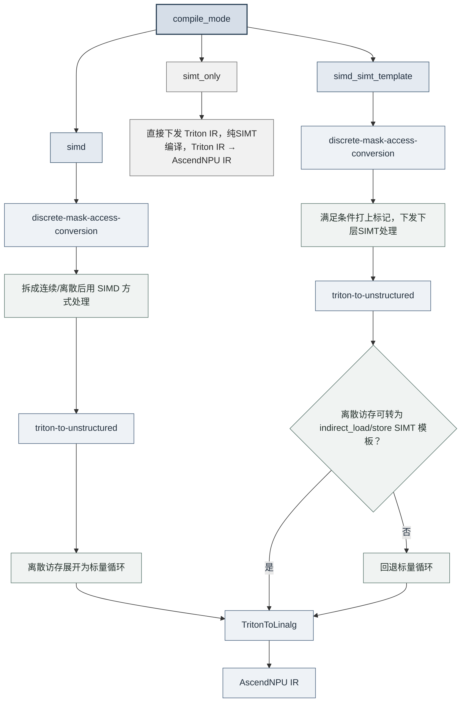

# 架构设计与核心特性

## 1.逻辑架构


**Triton-Ascend 架构说明**

**核心组件：**

- **`Ascend language extension`**：适配 Ascend 的 Triton 语言扩展
- **`compiler`**：适配 Ascend 的 Triton 编译器
- **`driver`**：适配 Ascend 的设备驱动接口

**组件功能：**

- **`Ascend language extension`**
  在标准 Triton 语言基础上，引入针对 Ascend NPU 架构的语法与语义扩展。

- **`compiler`**
  接收来自上层 Triton compiler 生成的中间表示文件 `TTIR`（Triton IR），执行一系列适配昇腾硬件的转换。

  ```text
  Triton IR → Linalg IR → AscendNPU IR → kernel*.o
  ```

  整个编译流程分为两个阶段：

  - **Triton-Ascend 阶段（Triton IR → Linalg IR）**：由 Triton-Ascend 的 MLIR Pass（如 `TritonToLinalg`）将 Triton IR 降级为 Linalg IR，完成算子语义到结构化线性代数表示的转换。
  - **BiSheng Compiler 阶段（Linalg IR → AscendNPU IR → `kernel*.o`）**：BiSheng Compiler 接管后续编译，将 Linalg IR 降级为面向 Ascend NPU 的 AscendNPU IR，执行硬件相关的指令选择、内存分配与调度优化，最终生成设备侧可执行二进制文件 `kernel*.o`。

- **`driver`**
  提供 Triton 运行时与 Ascend 软件栈（CANN）之间的对接能力，加载由 BiSheng Compiler 生成的设备侧可执行内核 `kernel*.o`。

## 2.代码结构

### 2.1 代码结构原则

本项目在标准 Triton 基础上，扩展支持华为 Ascend NPU（通过 CANN 软件栈）。整体设计遵循以下**代码原则**：

**（1）归属判断：按是否与硬件相关决定落点**

> - **若修改与目标硬件无关**（target independent），应保留在 **Triton core** 部分（如 language、runtime 的通用修改）；
> - **若修改与 Ascend 硬件强相关**（target affinitive），应放在 **Triton-Ascend** 中。

**（2）落地方式：非侵入社区代码，统一以 patch 承载**

为保持与上游 Triton / LLVM 的同步能力、降低版本升级时的合并冲突，默认**不直接修改社区源码**：

> - Ascend 专属逻辑优先在 `third_party/ascend/` 内以独立模块扩展，不就地改动 `python/`、`include/`、`lib/` 等社区目录；
> - 确需改动社区代码（Triton core 或 LLVM/MLIR）时，不直接修改源文件，而是沉淀为独立 `.patch`，统一放在 `third_party/ascend/patch/`，在构建准备阶段通过 `git apply` 打入；
> - 补丁需与明确的社区基线版本 / 提交对应（文件名体现版本号或 commit）；硬件无关的通用改进优先向上游社区贡献，从源头减少本地补丁存量。

### 2.2 目录结构与功能说明

| 目录或文件 | 对应架构层级 | 功能说明 |
| --- | --- | --- |
| `python/` | Triton core | 保留标准 Triton 的 Python 侧通用实现，包括 `triton.language`、JIT、运行时、缓存、工具链入口等。与硬件无关的通用能力优先放在该目录。 |
| `include/` 和 `lib/` | Triton core | 保留标准 Triton 的通用 C++/MLIR 基础设施、Dialect、Pass 和转换逻辑。这里不承载 Ascend 专属后端实现。 |
| `third_party/ascend/` | Triton-Ascend | Ascend 后端的根目录，集中放置与 Ascend NPU、CANN、BiSheng Compiler 强相关的语言扩展、编译后端、运行时驱动、MLIR Pass、示例和测试。 |
| `third_party/ascend/patch/` | Triton-Ascend | 存放对社区 Triton core 与 LLVM/MLIR 的非侵入补丁（`.patch`），在构建准备阶段经 `git apply` 打入，使社区源码树保持干净、便于跟随上游升级。 |
| `third_party/ascend/language/` | Ascend language extension | Ascend 语言扩展目录，安装后会链接到 `triton.language.extra` 下，供 Triton kernel 通过 `triton.language.extra.cann` 使用。 |
| `third_party/ascend/language/cann/libdevice.py` | Ascend language extension | 适配 Ascend NPU 的 `libdevice` Python 接口，提供数学函数和底层算子封装，供 Triton 算子调用。 |
| `third_party/ascend/backend/compiler.py` | compiler | Ascend 编译器后端主入口，负责注册编译选项、组织 TTIR 到 Ascend 适配 IR、Linalg/LLVM 等阶段的转换，并调用后续工具链生成可执行二进制文件。 |
| `third_party/ascend/backend/driver.py` | driver | Ascend 运行时驱动模块，负责与 CANN/TorchNPU 等运行时环境对接，加载并启动已编译的设备侧可执行文件。 |
| `third_party/ascend/include/` 和 `third_party/ascend/lib/` | compiler | Ascend 专属 MLIR Dialect、Pass 和转换实现，例如 `TritonToLinalg`、`TritonToStructured`、`DynamicCVPipeline`、`AutoBlockify` 等。 |
| `third_party/ascend/AscendNPU-IR/` | compiler | Ascend NPU 相关 IR 与 BiSheng 编译链适配内容，是从 Triton-Ascend 编译流程继续下沉到硬件侧代码生成的重要组成部分。 |
| `third_party/ascend/tutorials/` 和 `third_party/ascend/unittest/` | 示例与测试 | 提供 Ascend 平台上的 Triton 示例、迁移样例、Python 单元测试和 MLIR 转换测试，用于验证 Ascend 后端能力。 |

## 3. 模块

### 3.1 Triton core 增强

#### 3.1.1 语言扩展

为支持更灵活的张量子区域操作与单元素访问，语言层扩展了以下算子：

| 算子 | 功能简述 |
| :--- | :--- |
| `extension.insert_slice(full, src, offsets, sizes, strides)` | 按偏移、尺寸、步幅将源张量插入目标张量，返回目标张量。 |
| `extension.extract_slice(full, offsets, sizes, strides)` | 按偏移、尺寸、步幅从张量中提取切片，返回切片张量。 |
| `extension.get_element(source, offset)` | 按偏移量从张量中读取单个元素。 |

完整函数签名、各参数含义与示例以 Python API 参考为准（避免与架构文档两处维护）：见 [triton.language.extra.cann.extension](https://triton-ascend.readthedocs.io/zh-cn/latest/python-api/triton.language.extra.cann.extension.html) 的 *Vector/Memory Extension Ops*。

### 3.2 Triton-Ascend

#### 3.2.1 编译选项

NPUOptions 是控制**单个 kernel 编译策略**的参数，可通过 `triton.Config`、Autotune 参数或 kernel launch meta-parameter 传入，在编译期作用于 TTIR → Linalg IR → AscendNPU IR 的各阶段。按用途可分为以下几类：

| 类别 | 作用 | 典型选项 |
| --- | --- | --- |
| 编译模式与通用流水 | 选择 SIMD/SIMT 编译路径，控制 ping-pong 流水 | `compile_mode`、`multibuffer` |
| 图优化 | TTIR 层 Graph Optimization 开关 | `enable_graph_optimize` |
| CV 融合与 tiling | 自动绑定 sub-block、Cube/Vector 平衡与切分 | `enable_auto_bind_sub_block`、`enable_hivm_auto_cv_balance`、`enable_cube_block_merge`、`tile_mix_vector_loop`、`tile_mix_cube_loop` |
| VF / HFusion | 950 系列的 VF 融合策略与多 consumer 融合 | `enable_vf_fusion`、`vf_fusion_mode`、`hfusion_enable_multiple_consumer_fusion` |
| 同步 | 求解器、unit flag 及 barrier/block 注入 | `sync_solver`、`unit_flag`、`inject_barrier_all`、`inject_block_all` |
| 多缓冲与 Workspace | local buffer / workspace 的 multi-buffer 范围与档位 | `limit_auto_multi_buffer_only_for_local_buffer`、`limit_auto_multi_buffer_of_local_buffer`、`set_workspace_multibuffer` |
| DynamicCV 缓冲 | veccore / 跨核 / GM 的 buffer slot 数量 | `buf_slot_num_of_veccore`、`buf_slot_num_of_crosscore`、`buf_slot_num_of_gm` |
| 编译链透传 | 向毕昇编译路径透传附加参数 | `bisheng_options` |

完整选项清单、默认值 / 可选值与配置方式以参考文档为准（避免两处维护导致不一致）：见[环境变量与编译选项 · 编译选项参考表](https://triton-ascend.readthedocs.io/zh-cn/latest/environment_variable_and_compiler_options_reference.html#compiler-options-reference)；已废弃选项的兼容行为与更名映射见同文档[编译选项清理与兼容性](https://triton-ascend.readthedocs.io/zh-cn/latest/environment_variable_and_compiler_options_reference.html#compiler-option-cleanup-and-compatibility)。

#### 3.2.2 SIMD 编译器

| 序号 | Pass                   | 目的                                                                   | IR 转换                 |
| ------ | ---------------------- |----------------------------------------------------------------------| ----------------------- |
| 1      | triton-to-structured   | linearize                                                             | ttir->ttir              |
| 2      | triton-to-unstructured | convert indirect axis to loop                                        | ttir->ttir              |
| 3      | triton-to-linalg       | memory/reduction/view/creation/math/arith/linear algebra to linalgir | ttir->linalgir          |
| 4      | triton-to-other        | ttir->hivm/hfusion/llvm                                              | ttir->hivm/hfusion/llvm |

##### 3.2.2.1 TritonToStructured（结构化转换）

处理指针表达式和mask表达式中的整除取余，通过升维的方法，去除整除取余后重新生成load/store 等OP。

| Converter                | 功能  | 局限性 |
| ------------------------ | -------------------------- | ------------------------- |
| RewriteAddPtrOp          | 分析 `tl.load`, `tl.store`等操作中的指针表达式 (`AddPtrOp`)。将原始的指针偏移计算分解并建模为包含各维度（轴）具体偏移信息的 `PtrState` 对象。例如，对于形如 `ptr + x // 1024 * 4096 + x % 1024 * 4 + y` 的表达式，分析出 `x` 和 `y` 轴的贡献与关系。                   | 1. 所涉及的原始迭代轴（如`x`）必须能被分裂轴（如`1024`）整除；2. 外部的 `XBLOCK` 大小必须是分裂轴`divisor`的整数倍或其约数。                               |
| CreateAddPtr              | 根据分析得到的 `PtrState` 对象，重新构造一个新的 `AddPtrOp` 指针计算操作。新生成的指针表达式将消除原表达式中的整数除法 (`//`) 和取模 (`%`) 操作。                                                                       | 依赖于 `RewriteAddPtrOp` 成功生成的、合法的 `PtrState`。                                                                                                     |
| RewriteLoadOp            | 分析 `tl.load` 操作中的掩码 (`mask`) 表达式。将包含整除/取余的复杂掩码条件分解并建模为包含各维度边界信息的 `MaskState` 对象。例如，对于 `mask = x // 1024 < 8 and x % 1024 < 1024 and y < 4`，分析出各维度的独立约束条件。                                                                     | 1. 所涉及的原始迭代轴（如`x`）必须能被分裂轴（如`1024`）整除；2. 外部的 `XBLOCK` 大小必须是分裂轴`divisor`的整数倍或其约数。                               |
| BuildMask                | 根据分析得到的 `MaskState` 对象，重新构造一个新的掩码 (`mask`) 表达式。新掩码将消除原表达式中的整数除法 (`//`) 和取模 (`%`) 操作。                                                                                            | 仅处理由 `RewriteLoadOp` 或 `RewriteStoreOp` 生成的 `MaskState`。无法处理任意复杂的、非规范化的掩码表达式。                                                   |
| CreateLoad               | 使用由 `CreateAddPtr` 生成的新指针表达式和由 `BuildMask` 生成的新掩码表达式，重新创建（替换）原始的 `tl.load` 操作，完成指令重写。                                                                                                                                                               | 依赖于 `RewriteAddPtrOp`, `CreateAddPtr`, `RewriteLoadOp`, `BuildMask` 等前置步骤均成功执行。                                                                |
| RewriteStoreOp           | 分析 `tl.store` 操作中的掩码 (`mask`) 表达式。其功能与 `RewriteLoadOp` 类似，将包含整除/取余的复杂掩码条件分解并建模为 `MaskState` 对象。                                                                                                                                                       | 与 `RewriteLoadOp` 相同。                                                                                                                                    |
| CreateStore              | 使用由 `CreateAddPtr` 生成的新指针表达式和由 `BuildMask` 生成的新掩码表达式，重新创建（替换）原始的 `tl.store` 操作，完成指令重写。                                                                                                                                                              | 依赖于 `RewriteAddPtrOp`, `CreateAddPtr`, `RewriteStoreOp`, `BuildMask` 等前置步骤均成功执行。                                                               |
| RewriteAtomicRWMOp       | 处理原子读写修改操作（如 `atomic.add`, `atomic.max` 等）中的指针问题。                                                                                                                | 通常继承自 `RewriteAddPtrOp` 相同的局限性。对于某些特殊的、非连续或条件性的原子操作模式可能不支持。                                                           |
| RewriteAtomicCASOp       | 处理原子比较并交换操作 (`atomic.cas`) 中的指针线性化问题。分析其指针表达式，通过升维方法消除整除和取余操作，以匹配硬件原子指令的寻址要求。                                                                                                                                                      |                         |
| RewriteWhile             | 处理 `while` 循环体内的指针叠加操作。                                                          | 不支持循环体内包含条件分支 (`if`) 的复杂指针路径变换。                                         |
| RewriteFor               | 处理 `for` 循环体内的指针叠加操作。                        |                                              |

##### 3.2.2.2 TritonToUnstructured（非结构化转换）

| 序号 | Pass / 转换器                              | 描述  |
|------|-------------------------------------------|-----------------------------------------------------------------------------------------------------------------------------------------------------------------------|
| 1    | discrete-mask-access-conversion           | 将Triton中基于离散索引掩码（Discrete Mask）的内存访问模式（如`triton.language.load`带非连续mask）进行分析与转换，为后续将离散轴展开为循环做准备。该Pass识别出那些无法被后端硬件高效处理的、非规律性的或稀疏的访问模式。 |
| 2    | triton-to-unstructured           | 将经过`discrete-mask-access-conversion`识别出的、包含离散轴（Discrete Axes）的张量操作，转换为基于显式标量循环的标量访存。 |

###### 3.2.2.2.1 discrete-mask-access-conversion（离散掩码访存转换）

| 转换器名称                  | 描述|
|----------------------------|--------------------------------------------------------------------------------------------------------------------------------------------------------------------------------------------------------|
| DiscreteMaskStoreConversion | 首先进行mask分析，如果mask分析结果是非连续的，将原始的store操作转化为以下序列：1. load（加载目标存储地址的内容）→ 2. select（根据mask挑选目标存储内容和待存储的value内容）→ 3. store（将select的结果存储回目标地址） |
| DiscreteMaskLoadConversion  | 首先进行mask分析，如果mask分析结果是非连续的，将原始的load操作转化为以下序列：1. load（加载源tensor的所有内容）→ 2. select（根据mask挑选源tensor内容，被掩盖部分设置为other值）                     |
| DiscreteMaskAtomicAddConversion | 首先进行mask分析，如果mask分析结果是非连续的，将原始的atomic_add操作转化为以下序列：1. select（根据mask挑选value的值，被掩盖部分设为0）→ 2. atomic_add（使用select后的结果重新生成atomic_add操作） |

###### 3.2.2.2.2 triton-to-unstructured（转换为非结构化）

| TritonToUnstructured Converters | 描述 |
|---|---|
| UnstructuredMemAccessConverter\<triton::LoadOp\> | 将LoadOp转化为多重循环标量加载 |
| UnstructuredMemAccessConverter\<triton::StoreOp\> | 将StoreOp转化为多重循环标量存储 |
| UnstructuredMemAccessConverter\<triton::AtomicRMWOp\> | 将AtomicRMWOp转化为多重循环标量Atomic操作 |
| UnstructuredMemAccessConverter\<triton::AtomicCASOp\> | 将AtomicCASOp转化为多重循环标量Atomic操作 |

###### 3.2.2.2.3 bubble-up-operation（操作上移）

| 转换器名称 | 描述 |
|---|---|
| BubbleUpExtract\<tensor::ExtractOp\> | extract op顺序上移优化，在某些场景可以避免产生不必要的循环 |
| BubbleUpExtract\<tensor::ExtractSliceOp\> | extract op/extract_slice顺序上移优化，在某些场景可以避免产生不必要的循环 |

##### 3.2.2.3 TritonToLinalg（转换为 Linalg）

###### 3.2.2.3.1 triton-to-linalg（转换为 Linalg）

TritonToLinalg 用于将 TTIR 转换为 Linalg IR。

| Converter                                  | 描述                                                  |
| ------------------------------------------ | ------------------------------------------------------------ |
| StoreConverter                             | triton::StoreOp to memref::copy                              |
| AddPtrConverter                            | triton::AddPtrOp to memref::ReinterpretCastOp                  |
| GetProgramIDConverter                      | triton::GetProgramIdOp to a param in functionOp              |
| GetNumProgramsConverter                    | triton::GetNumProgramsOp to a param in functionOp            |
| LoadConverter                              | triton::LoadOp to memref::copy and bufferization::ToTensorOp |
| AtomicRMWConverter                         | triton::AtomicRMWOp to linalg::GenericOp                     |
| AtomicCASConverter                         | triton::AtomicCASOp to linalg::GenericOp                     |
| MakeRangeConverter                         | triton::MakeRangeOp to linalg::GenericOp                     |
| SplatConverter                             | triton::SplatOp to linalg::FillOp                            |
| ClampFConverter                            | triton::ClampFOp to tensor::EmptyOp, linalg::FillOp          |
| PreciseDivConverter                        | triton::PreciseDivFOp to arith::DivFOp                       |
| ArgMinConverter                            | triton::ArgMinOp to linalg::ReduceOp                         |
| ArgMaxConverter                            | triton::ArgMaxOp to linalg::ReduceOp                         |
| ReduceConverter                            | triton::ReduceOp to linalg::ReduceOp                         |
| ScanConverter                              | triton::ScanOp to func::CallOp                               |
| ReshapeConverter                           | triton::ReshapeOp to tensor::ReshapeOp                       |
| ExpandDimsConverter                        | triton::ExpandDimsOp to tensor::ExpandShapeOp                 |
| BroadcastConverter                         | triton::BroadcastOp to linalg::BroadcastOp                   |
| DenseConstantConverter                     | arith::ConstantOp to linalg::FillOp                          |
| ExternElementwiseClOpConverter             | triton::ExternElementwiseOp to linalg::MapOp                 |
| TritonMulhiuiConverter                     | triton::MulhiUIOp to arith::MulSIExtendedOp                  |
| TritonPreciseSqrtConverter                 | triton::PreciseSqrtOp to math::SqrtOp                        |
| AdvanceConverter                           | triton::AdvanceOp to memref::ReinterpretCastOp               |
| TransposeConverter                         | triton::TransOp to linalg::TransposeOp                       |
| SplitConverter                             | triton::SplitOp to tensor::ExtractSliceOp                    |
| JoinConverter                              | triton::JoinOp to tensor::InsertSliceOp                      |
| CatConverter                               | triton::CatOp to tensor::InsertSliceOp                       |
| BitcastConverter                           | triton::BitcastOp to arith::BitcastOp                        |
| LoopConverter\<scf::ForOp\>                | scf::ForOp to scf::ForOp                                     |
| LoopConverter\<scf::WhileOp\>              | scf::WhileOp to scf::WhileOp                                 |
| YieldConverter                             | scf::YieldOp to scf::YieldOp                                 |
| GatherConverter                            | triton::GatherOp to func::FuncOp                             |
| GatherLoadConverter                        | triton::GatherLoadOp to scf::ForOp                           |
| DeviceAssertConverter                      | triton::AssertOp to func::FuncOp                             |
| DevicePrintConverter                       | triton::PrintOp to func::FuncOp                              |
| MatmulConverter                            | triton::DotOp to linalg::MatmulOp                            |
| SortOpConverter                            | triton::SortOp to func::FuncOp                               |
| DotScaledConverter                         | triton::DotScaledOp to linalg::MatmulOp                      |
| PtrToIntConverter                          | triton::PtrToIntOp to memref::ExtractAlignedPointerAsIndexOp, arith::IndexCastOp |
| MakeTensorPtrConverter                     | triton::MakeTensorPtrOp to memref::ReinterpretCastOp         |

##### 3.2.2.4 其他 Pass

| Pass名称 | 功能描述 | 核心转换器 | 转换器描述 |
|---|---|---|---|
| triton-to-annotation | 处理Ascend NPU特有的编译提示指令 (`extension.compile_hint`)，将其转换为后端的Annotation方言，用于指导后续的硬件特定优化或资源配置。 | TritonAnnotationConversion | 将 `triton::AnnotationOp` 转换为 `annotation::MarkOp`，实现高级编译提示信息向底层注释标记的传递。 |
| triton-to-hfusion | 将Triton中的`TTIR`转换为Ascend NPU硬件加速器`HFusion`方言中的对应操作。 | TritonHistogramToHFusionConversion | 将 `triton::HistogramOp` 转换为 `hfusion::HistogramOp`，使其能在NPU的专用硬件上高效执行。 |
| triton-to-hivm | 处理Triton的块同步操作 (`extension.sync_block_all`, `extension.sync_block_set`, `extension.sync_block_wait`)，将其转换为Ascend NPU的`HIVM`方言中的跨核心同步指令。这些指令用于管理多核流水线中的同步与数据依赖，是流水优化的关键。 | TritonCustomOpToHIVMSyncOpConversion | 实现Triton同步指令到HIVM同步指令的转换：`sync_block_all`（全局块同步）；`sync_block_set`（设置同步点）；`sync_block_wait`（等待同步点） |
| triton-to-llvm | 将Triton中的内联汇编操作 (`extension.inline_assembly`) 转换为LLVM方言的内联汇编，并最终映射为Ascend NPU的CCE硬件固有函数（Intrinsics） | ElementwiseInlineAsmOpConversion | 将 `triton::ElementwiseInlineAsmOp` 转换为 `LLVM::InlineAsmOp` 。|

#### 3.2.3 SIMT 编译器（Ascend 950PR&950DT系列产品）

Ascend 950PR&950DT系列产品 在 SIMD 路径之外增加 SIMT 能力，用于加速**非结构化 / 离散**访存（如间接索引的 load/store）。
开发者通过 `compile_mode` 选择编译路径。

##### 3.2.3.1 `compile_mode` 说明

| `compile_mode` | 含义 | 编译路径 |
|---|---|---|
| `"simd"` | 纯 SIMD：结构化访存走 DMA；非结构化走标量循环 | `Triton IR → Linalg IR → AscendNPU IR` |
| `"simd_simt_template"`（**默认**） | 混合：结构化仍走 SIMD；离散访存尽量走 SIMT 模板 | `Triton IR → Linalg IR → AscendNPU IR` |
| `"simt_only"` | 纯 SIMT：直接下发 Triton IR 给NPU IR处理 | `Triton IR → AscendNPU IR` |

用法示例：

```python
# 纯 SIMD
kernel[grid](..., compile_mode="simd")

# 混合（默认；Ascend 950PR&950DT系列产品 上离散访存优先走 SIMT）
kernel[grid](..., compile_mode="simd_simt_template")

# 纯 SIMT
kernel[grid](..., compile_mode="simt_only", num_warps=32)
```

##### 3.2.3.2 三种模式的编译分流



| 阶段 | `"simd"` | `"simd_simt_template"` | `"simt_only"` |
|------|----------|--------------------------|---------------|
| 离散 mask 处理 | 拆成连续/离散边界，用 load + select / store 处理 | Ascend 950PR&950DT系列产品 且张量维数 ≤ 5：标记后交给下游；否则同左 | 不运行 |
| 非结构化访存 | 展开为标量循环 | 尽量转为 SIMT 间接访存（维数 ≤ 5）；失败则回退标量循环 | 不运行 |
| TritonToLinalg | 常规 Linalg IR 降级 | 常规 Linalg IR 降级 | 不运行 |

##### 3.2.3.3 混合模式：只对离散访存走 SIMT

混合模式**不会**把整个 kernel 切到 SIMT，只对离散 / 非结构化访存点走 SIMT，其余仍走 SIMD：

1. **离散 mask 处理**
   - 若判定为非连续 mask，且满足 Ascend 950PR&950DT系列产品、混合模式、维数 ≤ 5：不改写 IR，只标记「下游走 SIMT」。
   - 否则（纯 SIMD 或不满足条件）：将 mask 拆成连续 / 离散部分，用连续边界限定全局内存访问，再通过 select 合并结果。

2. **非结构化访存处理**
   - 在 Ascend 950PR&950DT系列产品 混合模式下，对非结构化访存或已标记的离散访存走 SIMT 快速通道：
     - `load` / `store` → `indirect_load` / `indirect_store`（维数 ≤ 5）
     - `atomic` 操作 → `hivm.custom(symbol="__builtin_indirect_atomic")`
   - 不满足条件则回退为标量循环（与 `"simd"` 一致）。

3. **TritonToLinalg**
   - 常规 Linalg IR 降级。

##### 3.2.3.4 纯 SIMT（`simt_only`）

`simt_only` 直接下发 Triton IR 交给 AscendNPU IR 做纯 SIMT 编译。

#### 3.2.4 Ascend 亲和算子

为表达标准 Triton 无法覆盖的 Ascend 硬件语义（Cube-Vector 跨核协作、UB 数据搬运、硬件特定访存等），后端在 `triton.language` 上扩展了一组 Ascend 亲和算子。按能力分为三类：

| 类别 | 代表扩展 | 架构作用 |
|---|---|---|
| 硬件特定数据搬运 | `extension.custom_op`（`index_select` / `index_put`、`gather_out_to_ub` / `scatter_ub_to_out`、`indirect_load` / `indirect_store` 等） | 支持基于索引的 gather/scatter、GM ↔ Unified Buffer 直传、间接地址访存等硬件特定搬运模式，供 SIMD/SIMT 各编译路径复用。 |
| 编译提示 | `extension.compile_hint` | 向编译器传递硬件特定提示，指导后端优化策略、资源分配与内核配置。 |
| 跨核块同步 | `extension.sync_block_wait` / `extension.sync_block_set` / `extension.sync_block_all` | 显式协调 Cube-Vector 架构下的核间执行顺序与数据依赖：点对点等待 / 通知，以及按模式广播的全局块同步。 |

各扩展的函数签名、参数取值、使用限制与示例以 Python API 参考为准（避免与架构文档两处维护）：见 [triton.language.extra.cann.extension](https://triton-ascend.readthedocs.io/zh-cn/latest/python-api/triton.language.extra.cann.extension.html)——索引/gather/scatter 等搬运类见 *Vector/Memory Extension Ops*、自定义算子机制见 *Custom Ops*、跨核同步见 *Synchronization*、编译提示与多缓冲见 *Core Types*。
